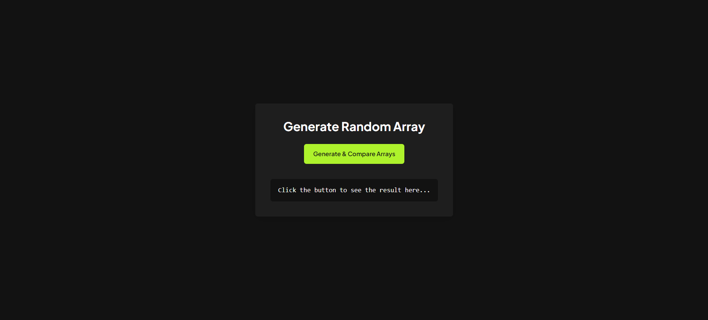
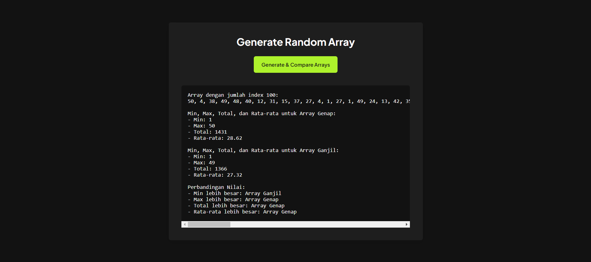

# Rakamin Javascript & Version Control Homework


## Cara Menjalankan Program

Anda dapat menjalankan aplikasi ini dengan dua cara:

### 1. Langsung dari Browser

- Clone repository ini dengan perintah:
  ```bash
  git clone https://github.com/OnyanPokon/homework-vcs.git
  ```
- Buka file index.html di browser Anda.

### 2. Langsung dari Browser

- Clone repository ini dengan perintah:
  ```bash
  git clone ttps://github.com/OnyanPokon/homework-vcs.git
  ```
- Buka proyek ini di Visual Studio Code.
- Install ekstensi Live Server.
- Klik kanan pada index.html dan pilih "Open with Live Server".

## Preview

### Spalsh



### Results




## Deskripsi Tugas

Tugas ini adalah bagian dari program Rakamin Academy yang menguji kompetensi dalam **JavaScript dasar**, termasuk penggunaan:

- Variabel (Var)
- Tipe Data
- Operator
- Percabangan
- Perulangan
- Array
- Fungsi

Peserta diminta untuk membuat algoritma untuk menganalisis data menggunakan **array**, menghitung **min**, **max**, **total**, dan **rata-rata**, serta membandingkan dua array yang terbentuk.

## Soal Homework

1. **Buatlah 100 nilai random** (1 sampai 50) dalam satu array.
2. **Pecahlah array tersebut** menjadi dua array berdasarkan indeks:
   - Array dengan indeks genap.
   - Array dengan indeks ganjil.
3. **Lakukan perhitungan** pada kedua array tersebut:
   - Nilai minimum.
   - Nilai maksimum.
   - Total nilai.
   - Rata-rata nilai.
4. **Bandingkan kedua array**:
   - Array mana yang memiliki nilai minimum lebih besar?
   - Array mana yang memiliki nilai maksimum lebih besar?
   - Array mana yang memiliki total lebih besar?
   - Array mana yang memiliki rata-rata lebih besar?

### Output yang Diharapkan:

- Array awal dengan 100 elemen.
- Array genap dan ganjil masing-masing dengan 50 elemen.
- Perhitungan min, max, total, dan rata-rata untuk kedua array.
- Hasil perbandingan antara array genap dan ganjil.

### Catatan:

- Dilarang menggunakan fungsi bawaan JavaScript untuk **min**, **max**, **total**, dan **rata-rata**.
- Kode harus dibagi menjadi beberapa fungsi agar mudah digunakan kembali.
- **Push** ke repository GitHub dan pastikan repository bersifat public.

## Langkah-Langkah Pengerjaan

1. **Langkah 1 (10 menit)**: Buat array dengan 100 elemen acak.
2. **Langkah 2 (20 menit)**: Pecah array menjadi dua berdasarkan indeks ganjil dan genap.
3. **Langkah 3 (90 menit)**: Lakukan perhitungan min, max, total, dan rata-rata pada kedua array.
4. **Langkah 4 (30 menit)**: Bandingkan hasil dari kedua array.
5. **Langkah 5 (15 menit)**: Push ke repository GitHub.

## Kriteria Penilaian

- Pemahaman logika dasar.
- Pemahaman algoritma.
- Implementasi JavaScript.
- Penggunaan Git untuk version control.
